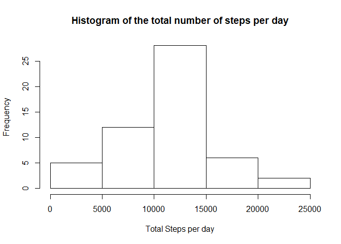
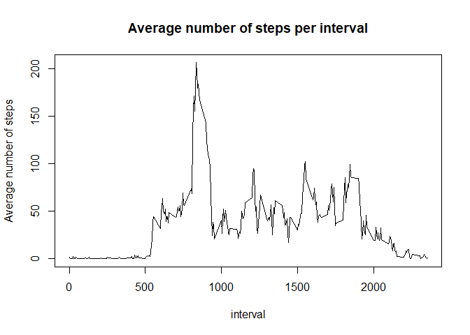
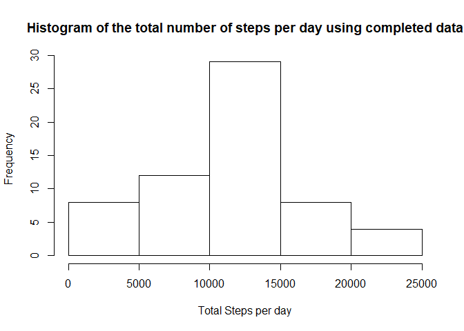
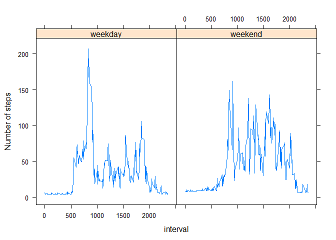

# Reproducible Research: Peer Assessment 1


## Loading and preprocessing the data

```r
library(readr)
data <- suppressMessages(readr::read_csv("activity.zip"))
```
## What is mean total number of steps taken per day?
Using the dplyr package, we group the data by date and compute the total number of steps per day.

```r
suppressMessages(library(dplyr))
grouped.data <- group_by(data, date)
data.per.day <- summarise(grouped.data, totalSteps =sum(steps,rm.na=TRUE))
```
The histogram of the total number of steps per day is produced using base plot system.

```r
hist(data.per.day$totalSteps, main = "Histogram of the total number of steps per day", xlab = "Total Steps per day")
```

<!-- -->

The mean and median of the total number of steps taken per day are computed using the following code :

```r
m <- mean(data.per.day$totalSteps, na.rm = TRUE)
md <- median(data.per.day$totalSteps, na.rm = TRUE)
```
This gives a mean equals to 10767.19 and a median equals to 10766.

## What is the average daily activity pattern?

Data is grouped by interval and summarized by computing the mean over all days for each interval:

```r
grouped.data2 <- group_by(data, interval)
data.per.interval <- summarise(grouped.data2, avgSteps =mean(steps,na.rm=TRUE))
```
The time series plot  :


```r
plot(x=data.per.interval$interval, y = data.per.interval$avgSteps, type = "l", main = "Average number of steps per interval", xlab = "interval", ylab = "Average number of steps")
```

<!-- -->

```r
idx <- which.max(data.per.interval$avgSteps)
maxinterval <- data.per.interval$interval[idx]
```
The maximum number of steps is achieved on average during the interval 835 -- 840.

## Imputing missing values
First, we calculate the number of missing values in the dataset:

```r
total.missing <- sum(is.na(data))
```
The total number of missing data  is 2304. These values can be replaced for example with the mean for the corresponding 5-minutes interval.

```r
completed.data <- data
missing <- is.na(data$steps)
mergedData <- merge(completed.data, data.per.interval)
completed.data[missing,"steps"] <-  mergedData[missing,"avgSteps"]
```


```r
grouped.data <- group_by(completed.data, date)
data.per.day <- summarise(grouped.data, totalSteps =sum(steps))
```
The histogram of the total number of steps per day (with completed data) is produced using base plot system.

```r
hist(data.per.day$totalSteps, main = "Histogram of the total number of steps per day using completed data", xlab = "Total Steps per day")
```

<!-- -->

The mean and median of the total number of steps taken per day from completed data are computed using the following code :

```r
m <- mean(data.per.day$totalSteps)
md <- median(data.per.day$totalSteps)
```
This gives a mean equals to 10889.8 and a median equals to 11015.

These values differ from those computed with imputing missing data. The median and mean incresed due to missing data imputing.


## Are there differences in activity patterns between weekdays and weekends?

First, we add a new variable to indicate whether the observation day is a weekend day or not.


```r
Sys.setlocale("LC_TIME", "English")
```

```
## [1] "English_United States.1252"
```

```r
newdata <- mutate(completed.data,daytype = ifelse(weekdays(date)=="Sunday" | weekdays(date)=="Saturday",yes="weekend",no="weekday"))
newdata$daytype <- as.factor(newdata$daytype)
```
Using lattice plot system, we plot the time series for both categories:

```r
suppressMessages(library(lattice))
grouped.data2 <- group_by(newdata, interval, daytype)
data.per.interval <- summarise(grouped.data2, avgSteps =mean(steps))
xyplot(avgSteps ~ interval|daytype,data.per.interval,type="l",layout=c(2,1),ylab="Number of steps")
```

<!-- -->
